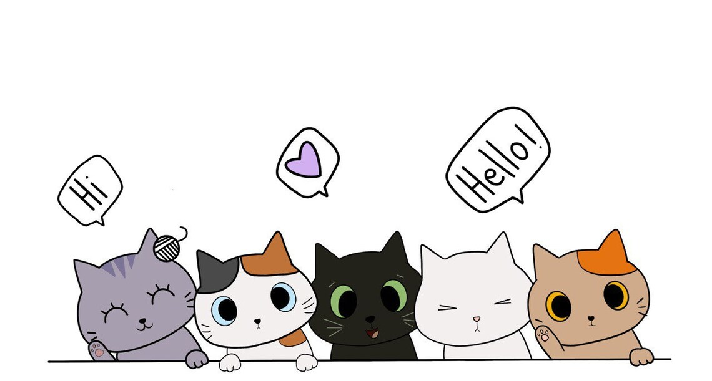

  

  

 

<h2 align="center">Something about Me:</h2>

  
Currently pursuing a Master’s in Computer Science at Saint Louis University, I’m focusing on IoT, machine learning, and databases. My role as a Teaching Assistant has enhanced my technical and mentoring skills. Previously, I worked as a Software Engineer at IBM, where I developed innovative solutions and collaborated with diverse teams.

  
  
Personal Website

